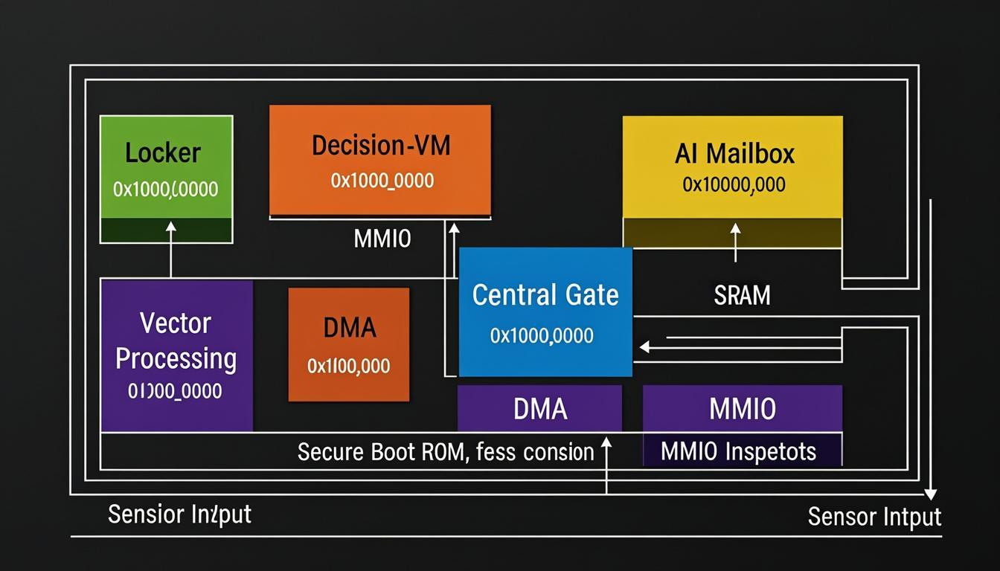

# Boreal SoC — Hardware Safety Kernel for AI Systems

<p align="center">
  
</p>

> A formally verified, open-source System-on-Chip that enforces **safety invariants in hardware** between an AI decision engine and physical actuators. Every action proposed by the AI must pass through an immutable Gate pipeline before reaching privileged I/O — and every decision is recorded in a tamper-evident ledger.

---

## Table of Contents

- [Overview](#overview)
- [Architecture](#architecture)
- [Module Reference](#module-reference)
- [Memory Map](#memory-map)
- [Project Structure](#project-structure)
- [Getting Started](#getting-started)
- [Build Targets](#build-targets)
- [Formal Verification](#formal-verification)
- [Phase A & Phase B](#phase-a--phase-b)
- [FPGA Synthesis](#fpga-synthesis)
- [Design Principles](#design-principles)
- [License](#license)

---

## Overview

Boreal SoC is a purpose-built silicon architecture that sits between an AI model's output and the real world. It guarantees — at the hardware level — that:

1. **No AI action reaches actuators without Gate approval** (allowlist, rate-limit, nonce, policy hash)
2. **Every decision is immutably logged** in an append-only ledger with hash-chain integrity
3. **Privileged I/O is physically unreachable** from the public bus — only the Gate can write to it
4. **Bounds clamping** sanitizes all values before they reach hardware
5. **Deterministic replay** is possible from the ledger alone

The design targets FPGA (Xilinx Artix-7 / Intel Cyclone V) and is written in synthesizable Verilog-2005 with SystemVerilog assertions for formal verification.

---

## Architecture

```
                    ┌──────────────────────────────────────────────┐
                    │                 Boreal SoC                   │
                    │                                              │
  CPU/Host ────────►│  ┌─────────┐    ┌─────────────┐             │
                    │  │ Boot ROM│    │  SRAM Tile  │             │
                    │  └─────────┘    └─────────────┘             │
                    │        │              │                      │
                    │  ┌─────┴──────────────┴──────────────┐      │
                    │  │         Interconnect               │      │
                    │  │   (pub master ↔ gate master arb)   │      │
                    │  └──┬────┬────┬────┬────┬────┬───┬──┘      │
                    │     │    │    │    │    │    │   │          │
                    │  ┌──┴┐┌──┴┐┌──┴┐┌──┴┐┌──┴┐┌──┴┐ │          │
                    │  │DMA││VEC││MBOX││ VM ││GATE││LED│ │          │
                    │  └───┘└───┘└───┘└───┘└──┬─┘└───┘ │          │
                    │                         │        │          │
                    │                    ┌────┴────┐   │          │
                    │                    │ PRIV I/O │◄──┘          │
                    │                    │ (Gate    │  (Gate-only) │
                    │                    │  only)   │              │
                    │                    └────┬────┘              │
                    └─────────────────────────┼──────────────────┘
                                              │
                                         Actuators / GPIO
```

**Key security boundary:** The Interconnect blocks any public-bus access to the `0x2000_0000` privileged region. Only transactions from the Gate master port can reach Privileged I/O.

---

## Module Reference

### Core RTL (`rtl/`)

| Module | File | Description |
|--------|------|-------------|
| **Package** | `boreal_pkg.v` | Global address map, opcodes, reason codes |
| **Interconnect** | `boreal_interconnect.v` | 2-master / N-slave crossbar with privilege enforcement |
| **Gate** | `boreal_gate.v` | 6-stage FSM: CHECK → CLAMP → COMMIT → LEDGER → RESPOND |
| **Gate Policy** | `boreal_gate_policy.v` | Allowlist, rate-limit, nonce, policy-hash checks |
| **Ledger** | `boreal_ledger.v` | 1024×256-bit append-only circular buffer with MMIO read |
| **DMA Ring** | `boreal_dma_ring.v` | Descriptor-ring DMA with CRC-32, sandboxed to SRAM |
| **Vector Engine** | `boreal_vector.v` | 8-lane int8 SIMD MAC for AI inference |
| **Vector Lane** | `boreal_vec_lane.v` | Single int8 multiply-accumulate lane |
| **AI Mailbox** | `boreal_ai_mailbox.v` | Dual-port mailbox for CPU ↔ VM communication |
| **Decision VM** | `boreal_decision_vm.v` | Microcode sequencer driving Gate requests |
| **Boot ROM** | `boreal_bootrom.v` | Immutable boot code with SHA-256 self-check |
| **SRAM Tile** | `boreal_sram_tile_bram.v` | 4 KB single-port SRAM (BRAM inference) |
| **Priv I/O** | `boreal_priv_io.v` | Gate-only actuator/GPIO register file |
| **SHA-256 Stub** | `boreal_sha256_stub.v` | Hash accelerator (stub for synthesis) |
| **Sig Verify** | `boreal_sigverify_stub.v` | Signature verification (stub) |
| **Top** | `boreal_top_fpga.v` | Top-level integration for FPGA |

### Phase A (`phase_a/`) — Integration Milestone

Standalone integration of core Gate + VM + Ledger + Interconnect with a simplified mailbox. Proves the security pipeline end-to-end.

### Phase B (`phase_b/`) — Full Feature Set

Adds atomic Gate, mailbox block, vector engine, DMA, and the full Phase-B interconnect with expanded address map.

---

## Memory Map

| Address Range | Module | Access |
|--------------|--------|--------|
| `0x0000_0000 – 0x0000_0FFF` | Boot ROM (4 KB) | Read-only |
| `0x0000_1000 – 0x0000_1FFF` | SRAM Tile 0 (4 KB) | Read/Write |
| `0x1000_0000` | DMA Registers | Read/Write |
| `0x1001_0000` | Vector Engine | Read/Write |
| `0x1002_0000` | AI Mailbox | Read/Write |
| `0x1003_0000` | Decision VM | Read/Write |
| `0x1004_0000` | Gate Registers | Read/Write |
| `0x1005_0000` | Ledger | Read/Write |
| `0x2000_0000` | **Privileged I/O** | **Gate-only** |

> See [`mmio_map.md`](mmio_map.md) for full register-level detail.
> See [`action_format.md`](action_format.md) for the Gate request/response protocol.

---

## Project Structure

```
boreal silocon/
├── rtl/                    # Synthesizable RTL (Verilog-2005)
│   ├── boreal_pkg.v        #   Global defines & address map
│   ├── boreal_gate.v       #   Gate safety pipeline
│   ├── boreal_interconnect.v#  Bus crossbar + privilege enforcement
│   ├── boreal_ledger.v     #   Append-only audit ledger
│   ├── boreal_dma_ring.v   #   Sandboxed DMA engine
│   ├── boreal_vector.v     #   SIMD vector engine
│   └── ...                 #   (16 modules total)
├── tb/                     # Testbenches (Icarus Verilog)
│   ├── tb_boreal_gate.v
│   ├── tb_boreal_boot.v
│   ├── tb_boreal_dma.v
│   ├── tb_boreal_vector.v
│   └── tb_boreal_interconnect.v
├── formal/                 # Formal verification (SymbiYosys + Z3)
│   ├── props/              #   SVA property modules
│   │   ├── fv_gate_props.sv
│   │   ├── fv_interconnect_props.sv
│   │   ├── fv_ledger_props.sv
│   │   └── fv_dma_props.sv
│   ├── fv_*_top.sv         #   Formal wrappers
│   └── fv_*.sby            #   SymbiYosys configurations
├── phase_a/                # Phase A integration (Gate+VM+Ledger)
├── phase_b/                # Phase B integration (full SoC)
├── syn/                    # FPGA synthesis scripts
│   ├── xilinx/             #   Vivado TCL + XDC constraints
│   └── intel/              #   Quartus TCL + SDC constraints
├── scripts/                # Utility scripts
│   └── setup_tools.sh      #   Tool installation helper
├── Makefile                # Build system (sim, lint, formal, synth)
├── boreal_soc.core         # FuseSoC package descriptor
├── action_format.md        # Gate protocol specification
├── mmio_map.md             # Full MMIO register reference
└── .github/workflows/ci.yml # GitHub Actions CI pipeline
```

---

## Getting Started

### Prerequisites

| Tool | Purpose | Install |
|------|---------|---------|
| **Icarus Verilog** | Simulation | `brew install icarus-verilog` |
| **Verilator** | Linting | `brew install verilator` |
| **Yosys** | Synthesis / Formal | `brew install yosys` |
| **SymbiYosys** | Formal proofs | [github.com/YosysHQ/sby](https://github.com/YosysHQ/sby) |
| **Z3** | SMT solver | `brew install z3` |

Or run the automated installer:

```bash
bash scripts/setup_tools.sh
```

### Quick Start

```bash
# Verify tools
make check-tools

# Run all simulation testbenches
make sim_all

# Lint the entire design
make lint

# Run formal verification
make formal
```

---

## Build Targets

| Target | Description |
|--------|-------------|
| `make check-tools` | Verify all required tools are installed |
| `make sim_gate` | Gate pipeline testbench |
| `make sim_boot` | Boot ROM testbench |
| `make sim_dma` | DMA engine testbench |
| `make sim_vector` | Vector engine testbench |
| `make sim_interconnect` | Interconnect testbench |
| `make sim_all` | Run **all** testbenches |
| `make lint` | Verilator lint (relaxed warnings) |
| `make lint-strict` | Verilator lint (strict mode) |
| `make coverage` | Simulation with VCD coverage |
| `make formal` | SymbiYosys formal proofs |
| `make synth-yosys` | Yosys generic synthesis + stats |
| `make synth-vivado` | Xilinx Vivado batch synthesis |
| `make synth-quartus` | Intel Quartus batch synthesis |
| `make ci` | Full CI pipeline (lint + sim_all) |
| `make clean` | Remove build artifacts |

---

## Formal Verification

Boreal SoC uses **bounded model checking** and **k-induction** via SymbiYosys with the Z3 SMT solver to prove safety invariants hold for all reachable states.

### Proven Properties

| Module | Property | Status |
|--------|----------|--------|
| **Interconnect** | Public bus cannot reach Privileged I/O (`0x2xxx_xxxx`) | **PROVED** (k-induction) |
| **Interconnect** | `priv_sel` only asserts when Gate is active master | **PROVED** |
| **Interconnect** | No slave selected when no request active | **PROVED** |
| **Interconnect** | Gate always wins arbitration | **PROVED** |
| **Gate** | Denied action → no privileged I/O write | **PROVED** (BMC-30) |
| **Gate** | Nonce counter monotonically non-decreasing | **PROVED** (BMC-30) |
| **Gate** | `act_ready` restored after response | **PROVED** (BMC-30) |
| **Ledger** | Index never decreases | Assertion defined |
| **Ledger** | Write increments index by exactly 1 | Assertion defined |
| **Ledger** | Slave always ACKs when selected | Assertion defined |
| **DMA** | `mem_wr` implies `mem_sel` | Assertion defined |
| **DMA** | Slave always ACKs when selected | Assertion defined |

Run all proofs:

```bash
sby -f formal/fv_interconnect.sby prove   # Full k-induction proof
sby -f formal/fv_gate.sby prove           # Bounded (depth 30)
sby -f formal/fv_ledger.sby prove         # Bounded
sby -f formal/fv_dma.sby prove            # Bounded
```

---

## Phase A & Phase B

### Phase A — Security Pipeline Proof-of-Concept

Minimal integration proving the Gate → Ledger → Priv I/O security chain:
- Simplified mailbox (dual-port)
- Gate + Decision VM + Ledger + Interconnect
- Single SRAM tile

```bash
# Phase A simulation
iverilog -o build/tb_phase_a.vvp -I rtl -g2012 phase_a/*.v phase_a/*.vh
vvp build/tb_phase_a.vvp
```

### Phase B — Full-Feature SoC

Adds production-grade modules:
- **Atomic Gate** with mailbox-based request/response
- **Mailbox Block** (3 logical mailboxes: AI input, action request, gate response)
- **Vector Engine** (8-lane int8 MAC with scratchpad)
- **DMA Engine** with descriptor ring
- **Expanded Interconnect** with 7 slave ports

```bash
# Phase B simulation
iverilog -o build/tb_phase_b.vvp -I rtl -g2012 phase_b/*.v phase_b/*.vh
vvp build/tb_phase_b.vvp
```

---

## FPGA Synthesis

### Xilinx (Artix-7)

```bash
make synth-vivado
# or manual: vivado -mode batch -source syn/xilinx/vivado_synth.tcl
```

Constraints: `syn/xilinx/boreal_soc.xdc` (100 MHz clock, placeholder pin assignments)

### Intel (Cyclone V)

```bash
make synth-quartus
# or manual: quartus_sh -t syn/intel/quartus_synth.tcl
```

Constraints: `syn/intel/boreal_soc.sdc`

### Generic (Yosys)

```bash
make synth-yosys    # Resource utilization stats without vendor tools
```

---

## Design Principles

1. **Hardware-enforced safety** — No software path can bypass the Gate. The Interconnect physically blocks public access to privileged I/O.

2. **Append-only audit** — The Ledger's index only increments; entries are never overwritten. Hash chains provide tamper evidence.

3. **Deterministic replay** — Given the same sequence of action requests, the Gate will produce identical outputs. The ledger captures enough state to replay any session.

4. **Defense in depth** — Allowlists, rate limits, nonce checks, policy hashes, and bounds clamping each provide independent safety layers.

5. **Synthesizable & portable** — Pure Verilog-2005 RTL targets any FPGA or ASIC flow. No vendor IP dependencies.

6. **Formally verified** — Critical security invariants are proven correct using SMT-based model checking, not just tested.

---

## CI Pipeline

GitHub Actions automatically runs on every push:

1. **Lint** — Verilator checks all RTL for warnings
2. **Simulate** — All testbenches (base, Phase A, Phase B) must pass
3. **Synthesis** — Yosys elaboration check

See [`.github/workflows/ci.yml`](.github/workflows/ci.yml).

---

## License

This project is open-source. See the repository for license details.
