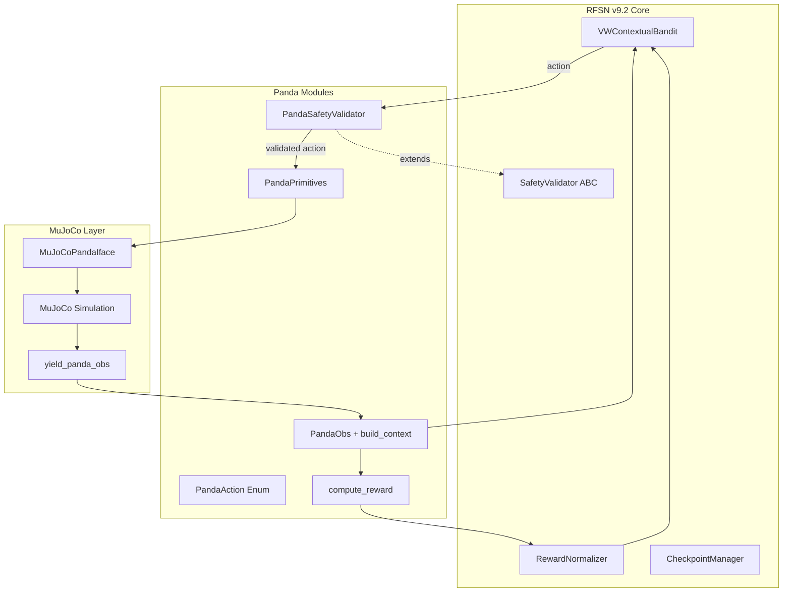

# Panda MuJoCo Integration with RFSN v9.2

Integrate a governed action selector for Franka Emika Panda robot that uses the v9.2 contextual bandit for "what to do next" decisions, with hard safety constraints, reward shaping, and MuJoCo simulation.

## User Review Required

> [!IMPORTANT]
> **Which Panda XML are you using?**
>
> - `mujoco_menagerie/franka_emika_panda` (community standard)
> - `robosuite` Panda model
> - Custom XML
>
> The site/body/actuator names (e.g., `ee_site`, `gripper`, `cube`) vary between XMLs. I'll need the specific model to provide exact name mappings.

---

## Proposed Changes

### Panda Core Package

Create a new `panda/` subdirectory with drop-in modules that integrate cleanly with the existing v9.2 architecture.

---

#### [NEW] [panda_actions.py](file:///Users/dawsonblock/Desktop/rfsn_v9_2_upgrade/panda/panda_actions.py)

8 discrete actions for pick-and-place:

| Action | Description |
|--------|-------------|
| `HOLD` | Stay still / keep current setpoint |
| `APPROACH_PREGRASP` | Move EE to pregrasp pose |
| `ALIGN_ORIENTATION` | Rotate EE to target grasp frame |
| `DESCEND` | Move down along approach vector |
| `CLOSE_GRIPPER` | Close gripper fingers |
| `LIFT` | Lift object after grasp |
| `RETREAT` | Move to retreat/place position |
| `BACKOFF_RESET` | Escape pose if stuck/unsafe |

---

#### [NEW] [panda_validator.py](file:///Users/dawsonblock/Desktop/rfsn_v9_2_upgrade/panda/panda_validator.py)

`PandaSafetyValidator` extends [SafetyValidator](file:///Users/dawsonblock/Desktop/rfsn_v9_2_upgrade/vw_bandit.py#L39-L73) with hard constraints:

| Constraint | Rule |
|------------|------|
| Collision | Block motion if `in_collision=True` (only HOLD/BACKOFF allowed) |
| Obstacle distance | Block if `min_dist_to_obstacle < 8cm` |
| Table clearance | Block DESCEND if `table_clearance < 1cm` |
| Joint velocity | Block motion if `joint_vel_norm > threshold` |
| Joint limits | Block if near joint limits + action would push further |
| Grasp preconditions | CLOSE_GRIPPER only if EE within 3cm + aligned <20° |
| Lift requires grasp | LIFT only if `grasp_confidence > 0.6` |

Safe default action: **HOLD**

---

#### [NEW] [panda_context.py](file:///Users/dawsonblock/Desktop/rfsn_v9_2_upgrade/panda/panda_context.py)

Context extractor that builds VW feature dict from `PandaObs` dataclass:

```python
@dataclass
class PandaObs:
    q: np.ndarray               # (7,) joint positions
    qd: np.ndarray              # (7,) joint velocities
    ee_pos: np.ndarray          # (3,) end-effector position
    ee_quat: np.ndarray         # (4,) end-effector quaternion
    obj_pos: np.ndarray         # (3,) object position
    target_pregrasp_pos: np.ndarray
    target_grasp_quat: np.ndarray
    min_dist_to_obstacle: float
    table_height_z: float
    in_collision: bool
    gripper_width: float
    gripper_commanded_width: float
    ft_norm: float              # wrist force/torque norm
    joint_limit_margin_min: Optional[float]
```

Output context dict includes: `ee_dx`, `ee_dy`, `ee_dz`, `ee_to_obj_dist`, `ee_align_err_rad`, `min_dist_to_obstacle`, `table_clearance`, `joint_vel_norm`, `joint_limit_margin_min`, `grasp_confidence`, `in_collision`, `gripper_width`, `ft_norm`

---

#### [NEW] [panda_reward.py](file:///Users/dawsonblock/Desktop/rfsn_v9_2_upgrade/panda/panda_reward.py)

Reward shaping compatible with v9.2's [RewardNormalizer](file:///Users/dawsonblock/Desktop/rfsn_v9_2_upgrade/vw_bandit.py#L182-L237) + [RewardDecayScheduler](file:///Users/dawsonblock/Desktop/rfsn_v9_2_upgrade/vw_bandit.py#L240-L262):

| Signal | Value |
|--------|-------|
| Success | +10 |
| Collision | -10 |
| Timeout | -2 |
| Slip detected | -3 |
| Progress (distance reduced) | `+2 × (prev_dist - cur_dist)` |
| Alignment improved | `+1 × (prev_ang - cur_ang)` |
| Grasp confidence bonus | `+3 × max(0, gc - 0.5)` |

---

#### [NEW] [panda_primitives.py](file:///Users/dawsonblock/Desktop/rfsn_v9_2_upgrade/panda/panda_primitives.py)

Deterministic motion executor that maps actions → motion primitives:

- `HOLD` → maintain current joint setpoint
- `APPROACH_PREGRASP` → Cartesian servo to pregrasp pose
- `ALIGN_ORIENTATION` → rotate EE to target quaternion
- `DESCEND` → move down 4cm along Z
- `CLOSE_GRIPPER` → command gripper to close
- `LIFT` → move up by `lift_delta_z` (default 12cm)
- `RETREAT` → move to retreat position
- `BACKOFF_RESET` → return to safe home pose

---

### MuJoCo Integration

---

#### [NEW] [mujoco_panda_iface.py](file:///Users/dawsonblock/Desktop/rfsn_v9_2_upgrade/panda/mujoco_panda_iface.py)

Low-level MuJoCo interface providing:

- `get_q()` / `get_qd()` → joint state
- `get_ee_pose()` → (position, quaternion)
- `get_obj_pos()` → object position
- `get_table_height()` → table surface Z
- `goto_cartesian()` → DLS IK solver + joint command
- `close_gripper()` / `open_gripper()`
- `hold()` / `backoff_to_safe_pose()`

Configurable via `MuJoCoPandaConfig` dataclass for XML-specific names.

---

#### [NEW] [mujoco_panda_obs.py](file:///Users/dawsonblock/Desktop/rfsn_v9_2_upgrade/panda/mujoco_panda_obs.py)

Generator that yields `PandaObs` from MuJoCo state:

```python
def yield_panda_obs(model, data, panda_iface, *,
                    target_pregrasp_pos, target_grasp_quat) -> Iterator[PandaObs]:
    ...
```

---

#### [NEW] [run_mujoco_panda_bandit.py](file:///Users/dawsonblock/Desktop/rfsn_v9_2_upgrade/panda/run_mujoco_panda_bandit.py)

Demo training loop that:

1. Loads Panda XML into MuJoCo
2. Initializes `RFSNController` with 8 actions, 12-dim context
3. Runs episodes with `select_action_with_safety()` + `PandaSafetyValidator`
4. Steps physics and updates bandit with normalized rewards
5. Optional viewer for visualization

---

#### [NEW] [**init**.py](file:///Users/dawsonblock/Desktop/rfsn_v9_2_upgrade/panda/__init__.py)

Package exports for clean imports.

---

## Verification Plan

### Automated Tests

Run with:

```bash
cd /Users/dawsonblock/Desktop/rfsn_v9_2_upgrade
python -m pytest panda/test_panda_modules.py -v
```

Tests to create:

1. **test_panda_actions** - Verify enum values and action-to-name mapping
2. **test_panda_validator** - Test each constraint rejects/allows correctly:
   - Collision blocks motion
   - Obstacle distance threshold
   - Grasp preconditions
   - Safe default returns HOLD
3. **test_panda_context** - Verify `build_context()` produces correct keys/values
4. **test_panda_reward** - Verify reward computation for success/failure/progress cases

### Integration Test

Run with:

```bash
cd /Users/dawsonblock/Desktop/rfsn_v9_2_upgrade
python panda/run_mujoco_panda_bandit.py --xml <path_to_panda.xml> --episodes 10 --no-render
```

Verifies the full loop works end-to-end in headless mode.

### Manual Verification (User)

1. Run with rendering enabled:

   ```bash
   python panda/run_mujoco_panda_bandit.py --xml <path> --episodes 1 --render
   ```

2. Observe that:
   - Robot moves toward object
   - Unsafe actions (e.g., descending into table) are blocked
   - Gripper closes only when near object
   - Episode terminates on success or timeout

---

## Architecture Diagram



---

## File Structure After Implementation

```
rfsn_v9_2_upgrade/
├── __main__.py
├── vw_bandit.py
├── config.py
├── test_vw_bandit.py
├── panda/
│   ├── __init__.py
│   ├── panda_actions.py
│   ├── panda_validator.py
│   ├── panda_context.py
│   ├── panda_reward.py
│   ├── panda_primitives.py
│   ├── mujoco_panda_iface.py
│   ├── mujoco_panda_obs.py
│   ├── run_mujoco_panda_bandit.py
│   └── test_panda_modules.py
```
